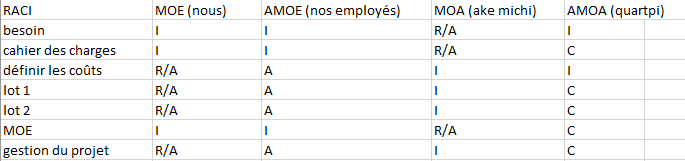
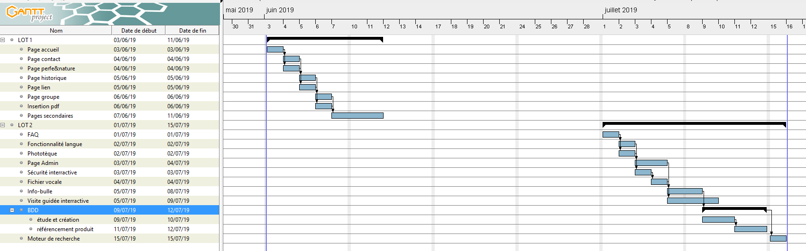

# CAHIER DES CHARGES

## OBJECTIF

## RISQUES, CONTRAINTES, EXIGENCES

## LE RENDU

### QQOQCP  

`Quoi  - objet, action, phase, opération.`  
`Qui - est concerné, acteur, responsable.`  
`Quand - moment, planning, durée, fréquence.`  
`Comment - matériel, équipement, moyens nécessaires, manières, modalités, procédures.`  
`Combien - temps nécessaire, prix, durée.`  
`Pourquoi - motivations pour réaliser une telle action, respecter telle procédure...`  

  Quoi ?  
    
Le cahier des charges nous explique que le projet est réparti en 3 lots importants. Nous allons devoir faire la création et le transfert d'un nom de domaine pour le site web AKE Michi sous `www.akemichi.fr`. Puis l'hébergement web se fera sous le service OVH Inc. où nous aurons accès via nos locaux.

  Qui ?
  
  
  
  Quand ?
  

  Comment ?
    
Les moyens nécessaires qui seront employés au cours du projet s'établissent en trois catégories. 
Nous aurons besoin de fonds sur le plan matériel, que ce soit pour les ordinateurs où des configurations peuvent être utilisées.
Suivant les besoins matériels, nous devrons employer des ressources logistiques tels que des logiciels spécifiques aux serveurs, manipulations des du site web pour des optimisations suivantes.
Sur ce projet, nous aurons en plus besoins des ressources humaines pour l'élaboration du projet en temps voulu, mais aussi pour la réactivité suites à d'éventuels problèmes.

  Pourquoi ?
    
Par le cahier des charges que vous nous avez fournis, nous comprennons que le site doit être créer pour une meilleure visibilité et compréhension pour vos clients. Nous souhaitons donc pouvoir comprendre vos moindres attentes afin de vous fournir un site adéquat.