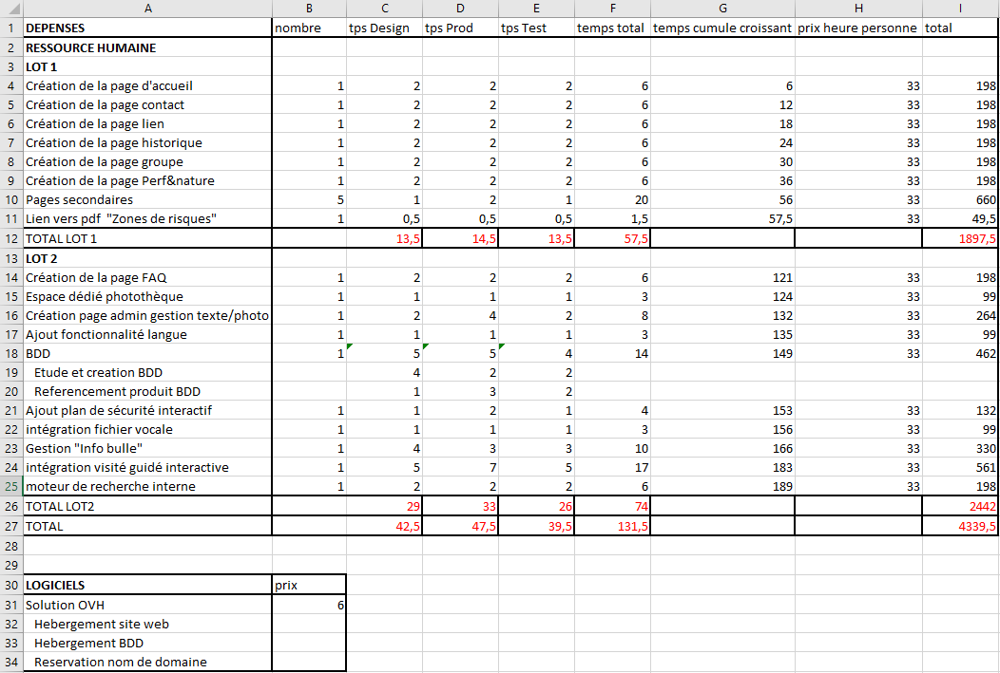

# CAHIER DES CHARGES

## TOPWEB Inc.

### QQOQCP  

`Quoi  - objet, action, phase, opération.`  
`Qui - est concerné, acteur, responsable.`  
`Quand - moment, planning, durée, fréquence.`  
`Comment - matériel, équipement, moyens nécessaires, manières, modalités, procédures.`  
`Combien - temps nécessaire, prix, durée.`  
`Pourquoi - motivations pour réaliser une telle action, respecter telle procédure...`  

  Quoi ?  
    
Le cahier des charges nous explique que le projet est réparti en deux lots importants.  
Pour le premier lot, nous commencerons par créer et organiser les six premières pages puis les pages secondaires et les liens des autres sites associés à AKE Michi. Le permier lot est réparti sur une durée de 12 jours, plus les jours précédents le 1er Juillet afin de vérifier et de tester la fonctionnalité du lot.
Nous allons devoir faire la création et le transfert d'un nom de domaine pour le site web AKE Michi sous `www.akemichi.fr` et nous vous proposons l'hébergement web sous le service OVH Inc.  
Ensuite, une partie du deuxième lot portera sur l'étude de la base de donnée et de sa création puis de son référencement des produits pour ensuite avoir accès à un moteur de recherche compris dans le site.  
Pour finir, nous créerons la page FAQ, la photothèque, la page Admin, la gestion de "l'info bulle", le plan de sécurité interactif ainsi que l'ajout de la fonctionnalité languistique que nous réaliserons durant seize jours.  

  Qui ?
  
  
  
  Quand ?
  

  Combien ?  

  
  
  Comment ?
    
Les moyens nécessaires qui seront employés au cours du projet s'établissent en trois catégories.  
Nous aurons besoin de fonds sur le plan matériel, que ce soit pour les ordinateurs où des configurations peuvent être utilisées.
Suivant les besoins matériels, nous devrons employer des ressources logistiques tels que des logiciels spécifiques aux serveurs, manipulation du site web pour des optimisations suivantes.  
Sur ce projet, nous aurons en plus besoins des ressources humaines pour l'élaboration du projet en temps voulu, mais aussi pour la réactivité suite à d'éventuels problèmes.  

  Pourquoi ?
    
Par le cahier des charges que vous nous avez fournis, nous comprennons que le site doit être créer pour une meilleure visibilité et compréhension pour vos clients. Nous souhaitons donc pouvoir comprendre vos moindres attentes afin de vous fournir un site adéquat.  